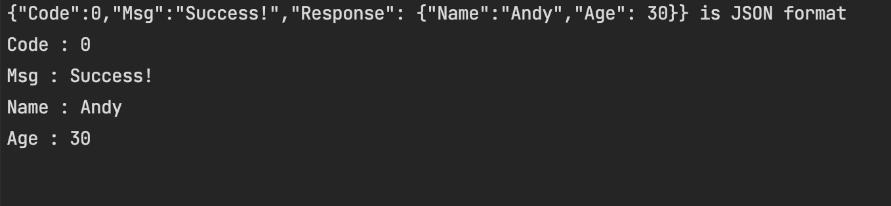
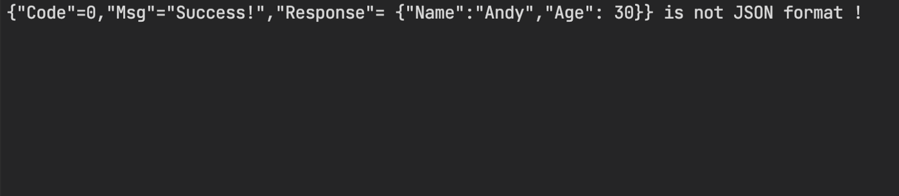

最近遇到與API串接資料時遇到一個狀況，有可能取得的資料是一段 HTML 或者是特定的 Json 格式的字串進而往下繼續處理業務邏輯。因為 API 端暫時沒有設計合適的資料結構，所以現階段也只能用現行的資料來做判斷是否是特定的 Json 資料。而且有時收到 API 的資料的內容並不是 Json 格式的回傳結果，而是直接回覆一個網頁 HTML 用來顯示錯誤訊息（汗），查了一下文件，只有看到似乎沒有直接可以使用在 .NET Core的套件，與同事們討論解決方案後，JsonTryParse 就這樣誕生了。
## 設計思路
專案是採前後端分離開發方式，向API發送請求後取得Response的資料有既定的格式。只是有時即便是收到HttpStatusCode是200，但裡面的資料卻不是Json 格式（汗）

因此為了要確定真的收到了「預期的」結果，當收到API回傳的HttpStatusCode是200後，先把收到API回傳的Response透過JsonSerializer.Deserialize，看是否能被解析回物件，如果無法解析的話，就回傳預設值。

先來看預期的Response資料（如下）。

```json
{
    "Code": 0,
    "Msg": "Success!",
    "Response": {
        "Name": "Andy",
        "Age": 28
    }
}
```
有時卻遇到HttpStatusCode:200時，會收到HTML Content的Response。

```html
<html lang="en">

<head>
    <meta charset="UTF-8">
    <meta http-equiv="X-UA-Compatible" content="IE=edge">
    <meta name="viewport" content="width=device-width, initial-scale=1.0">
    <title>Document</title>
</head>

<body>
    <H1>Error:404(找不到資料)</H1>
</body>

</html>
```
## 實作部分
為了要讓字串可以很方便的使用JsonTryParse，於是把JsonTryPares寫成擴充方法，並且設計成泛型方法，在可以解析成指定的型別時，把解析後的結果回傳，如果無法解析時，就回傳預設值。

```csharp
public static class JsonParseExtension
{
	public static bool JsonTryParse<T>(this string jsonString, out T result) where T : class
    {
        try
        {
            result = JsonSerializer.Deserialize<T>(jsonString);
            return true;
        }
        catch(Exception e)
        {
            result = default;
            Debug.WriteLine(e.Message);
            return false;
        }
    }
}
```
這邊建立一個BaseModel，BaseModel為收到API資料時的基本格式。

```csharp
public class BaseModel<T> where T : class
{
	[JsonPropertyName("Code")]
	public int Code { get; set; } = -1;
	[JsonPropertyName("Msg")]
	public string Message { get; set; }
	[JsonPropertyName("Response")]
	public T Response { get; set; }
}
```

接著建立一個User的Model，代表接收到的Response是User的格式。

```csharp
public class User
{
    [JsonPropertyName("Name")]
    public string Name { get; set; }
    [JsonPropertyName("Age")]
    public int Age { get; set; }
}
```

寫個Console測試看看，先產出JSON字串，再透過JsonTryParse，看看是否可以解析成功，解析成功時把User的Name以及Age印出來看。

```csharp
class Program
{
	static void Main(string[] args)
	{
		var jsonString = CreateMockJsonString();
		var isJsonFormat = jsonString.JsonTryParse<BaseModel<User>>(out var jsonResult);
		if (!isJsonFormat)
		{
			Console.WriteLine($"{jsonString} is not JSON format !");
		}
		else
		{
			Console.WriteLine($"{jsonString} is JSON format");
			Console.WriteLine($"Code : {jsonResult.Code}");
			Console.WriteLine($"Msg : {jsonResult.Message}");
			Console.WriteLine($"Name : {jsonResult.Response.Name}");
			Console.WriteLine($"Age : {jsonResult.Response.Age}");
		}

	}
	static string CreateMockJsonString()
	{
		return @"{""Code"":0,""Msg"":""Success!"",""Response"": {""Name"":""Andy"",""Age"": 30}}";
	}
}
```

## 執行結果：





如有需要Source Code，可以直接到我的GitHub內查看。

[AndyHuang1223/JsonParseSample (github.com)](https://github.com/AndyHuang1223/JsonParseSample)

## 參考資料
https://docs.microsoft.com/zh-tw/uwp/api/windows.data.json.jsonobject.tryparse?view=winrt-19041
