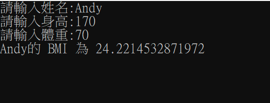
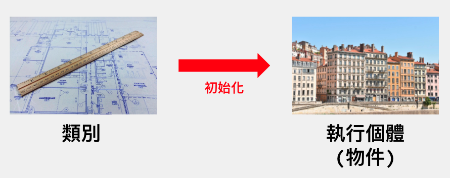

在學習C#的路上一定會遇到一個名詞叫做「物件導向設計原則」，這個原則描述了如何以「物件」作為程式的基本設計單位，透過物件之間互動的行為，來完成所需要的功能。而不是只利用多個「函式」集合對電腦下達指令。
在討論物件之前，先來撰寫一個計算BMI的程式，這個程式有幾個功能：
1. 可以輸入姓名、身高以及體重
2. 輸入完之後，電腦會計算BMI值
3. 計算完BMI後，顯示計算結果，結果包含姓名以及BMI值
依據這個需求我們可以先來寫一個C#的主控台應用程式
```csharp
class Program
{
    static void Main(string[] args)
    {
        Console.Write("請輸入姓名：");
        string name = Console.ReadLine();
        Console.Write("請輸入身高：");
        double height = double.Parse(Console.ReadLine());
        Console.Write("請輸入體重：");
        double weight = double.Parse(Console.ReadLine());

        double bmi = weight / Math.Pow(height / 100, 2);
        Console.WriteLine($"{name} 的 BMI 為{bmi}");

        Console.ReadLine();
    }
}
```
我們也可以將計算BMI後顯示資訊的部分撰寫成「方法」，如下：
```csharp
class Program
{
    static void Main(string[] args)
    {
        Console.Write("請輸入姓名：");
        string name = Console.ReadLine();
        Console.Write("請輸入身高：");
        double height = double.Parse(Console.ReadLine());
        Console.Write("請輸入體重：");
        double weight = double.Parse(Console.ReadLine());
        ShowBmi(name, height, weight);
        Console.ReadLine();
    }

    static void ShowBmi(string name, double height, double weight)
    {
        double bmi = weight / Math.Pow(height / 100, 2);
        Console.WriteLine($"{name} 的 BMI 為{bmi}");
    }
}
```
用上面的「方法」來把計算並顯示BMI的邏輯與主程式區塊拆開，如此一來可以很快速地知道我們的在撰寫的功能是什麼，以及可以重複使用此方法。

## 思考一下
- 除了「人」之外，還有什麼樣的東西有在計算BMI呢？
- 有沒有可能其他的東西，也可以使用我們寫的ShowBMI方法呢？
很明顯的，BMI公式目前只適用在人類身上，但目前的程式並不一定只有「人類」可以使用，只要給定ShowBMI方法符合的參數（字串及浮點數）時，就也是會被執行。如此一來，是不是任何東西都可以使用ShowBMI呢？

## 為什麼使用物件導向的設計？
根據上面的例子，你的程式碼就變成並不是只有「人類」可以使用ShowBMI，如果說今天ShowBMI只想計算「人類」呢？

今天人類除了有ShowBMI之外，是不是也可以有其他的特徵或行為呢？

## 如何設計物件導向的程式？
- 抽象(動詞)：抽取物件本質的屬性（ex.是個人都會有的特徵，身高、體重、年齡…）
- 限制、約束 ：模組化設計（ex.Person的身高與體重、Rectangle的寬與高…，會被綁定在一起的），可以重複使用。
- 只把需要的資訊公開，隱藏不必要的訊息 ：封裝
- 重複使用、擴充、修改原本的類別，產生衍生的類別（跟原本相關但不完全一樣）：繼承、多型(從哺乳類動物 ->人類，或者從人類 -> 台灣人、美國人…)

## 所以物件是什麼？
這裡的物件並不單只是在講程式世界裡面的物件，而是在討論在我們的世界中，物件究竟是什麼？
- 是個存在的東西
- 有特徵可以描述的
- 可能會做某些行為
- 會被製造出來的

## 如何製造物件？
- 透過設計圖、藍圖
- 在C#世界裡面，可以利用「類別」(Class)來設計物件（類別是設計圖）
- 從類別產生出來的物件我們就稱它為「執行個體」或「實例」(Instance)
- 除了類別之外，「結構」(Struct)也可以產生物件（像是DateTime），我們就先從類別開始學習

## 來設計Person類別吧
```csharp
public class Person
{
    public string Name { get; set; }
    public double Height { get; set; }
    public double Weight { get; set; }
}
```
寫在Person內的Name、Height、Weight是類別的屬性，這部分我們會在之後提及。

## 接著在Program類別內，新增ShowBMI方法
```csharp
class Program
{
    static void Main(string[] args)
    {
        Console.Write("請輸入姓名：");
        string name = Console.ReadLine();
        Console.Write("請輸入身高：");
        double height = double.Parse(Console.ReadLine());
        Console.Write("請輸入體重：");
        double weight = double.Parse(Console.ReadLine());
        Person person = new Person
        {
            Name = name,
            Height = height,
            Weight = weight
        };
        ShowBmi(person);
        Console.ReadLine();
    }

    static void ShowBmi(Person person)
    {
        double bmi = person.Weight / Math.Pow(person.Height / 100, 2);
        Console.WriteLine($"{person.Name} 的 BMI 為{bmi}");
    }

}

public class Person
{
    public string Name { get; set; }
    public double Height { get; set; }
    public double Weight { get; set; }
}
```

## 查看結果


## 物件 vs 類別
- 類別本身是一種型別，也就是宣告變數時可以使用類別來宣告。
- 物件是透過類別產生出來的，這個部分就是產生「執行個體」（物件）。
- 類別 = 設計圖，執行個體 = 從設計圖蓋出來的房子。



## 小結
如此一來，我們的ShowBMI方法，現在傳入的參數就變成「Person」物件，也就是限制了只有Person可以使用這個方法，透過Person類別產生Person的執行個體（Person物件）。
下一篇我們會討論類別的成員，像是上面Person類別內的Name、Height、Weight，這些只是類別的其中一種成員，還有許多成員我們就等下一篇再利用Person類別來介紹囉！
