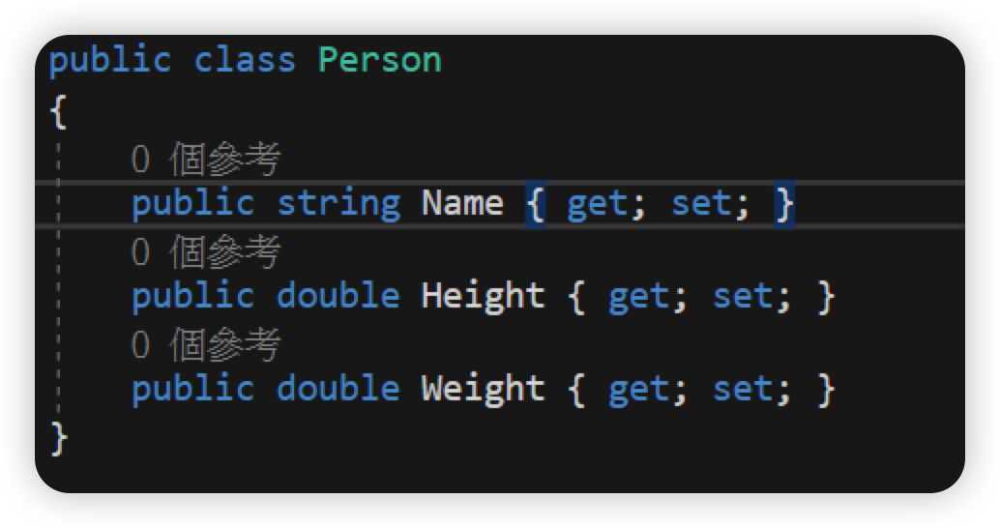
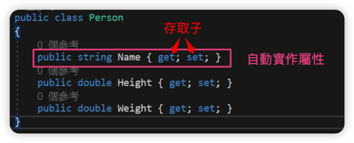
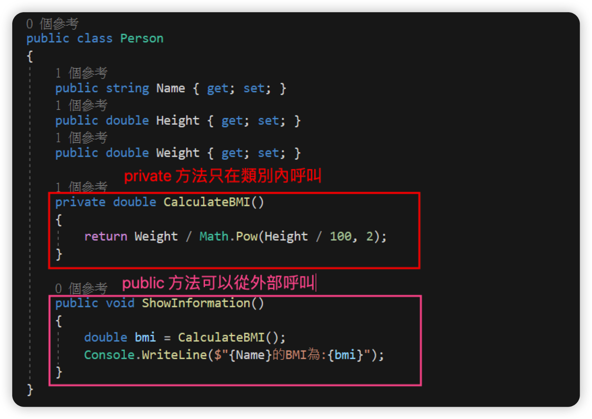
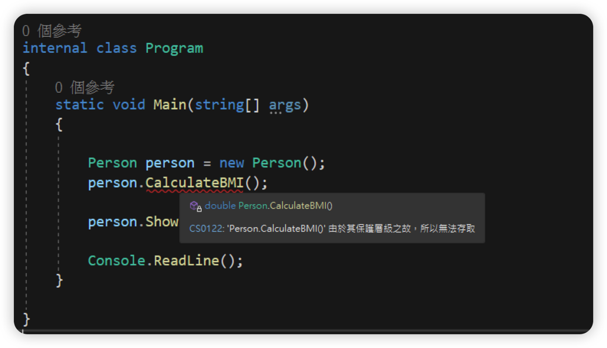
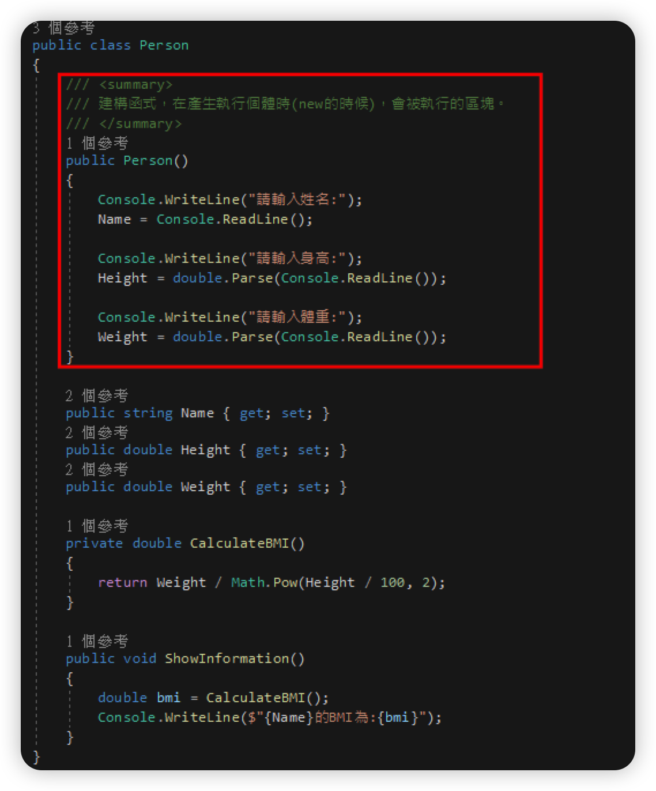
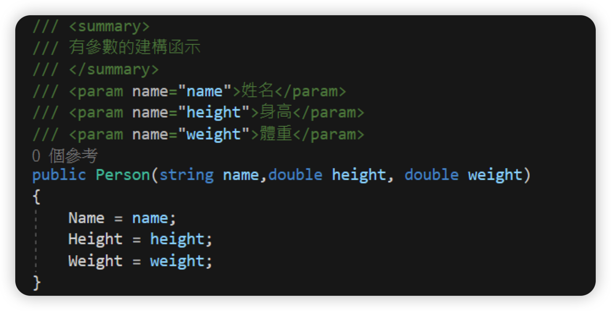
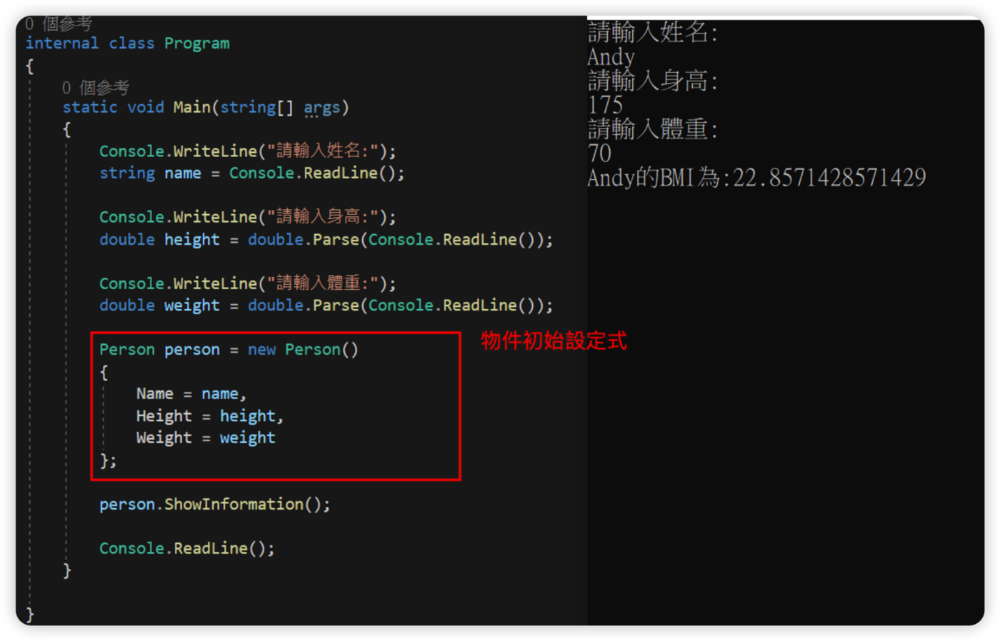
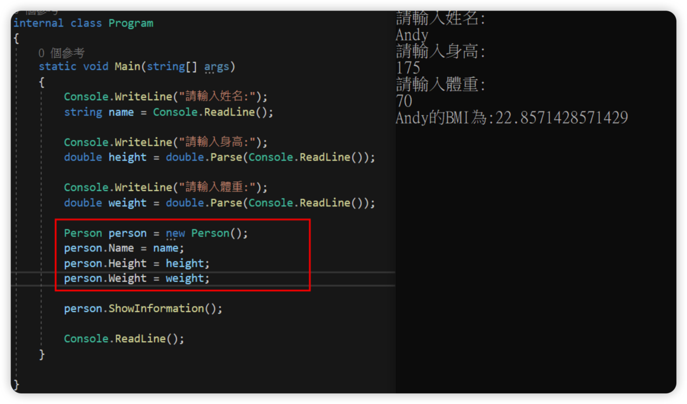
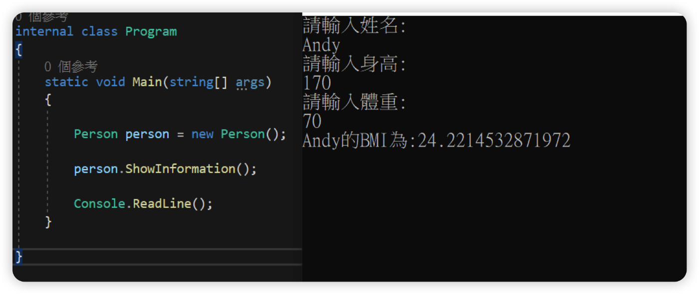
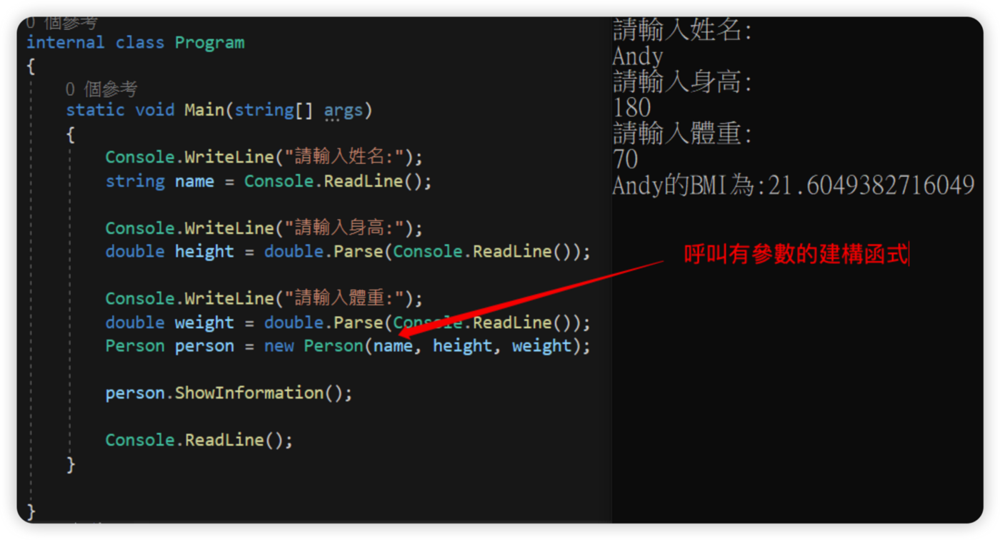

上一篇提到：類別是設計圖（藍圖），物件是透過設計圖產生的執行個體，而類別的設計，我們就要先從「類別的成員」開始說起…
## 類別成員
類別裡面可以放的成員有非常多：
- 屬性
- 方法
- 建構函式
- …(可以參考：[成員 — C# 程式設計手冊 | Microsoft Docs](https://docs.microsoft.com/zh-tw/dotnet/csharp/programming-guide/classes-and-structs/members))
我們就用先前的Person類別，開始介紹吧！

## 屬性
- 屬性可以讓類別可以公開取得和設定值的功用方式，同時隱藏實作或驗證程式碼。
- 透過存取子(get set)給外部取得值或者指派新的值，同時具有get set存取子的屬性具有「讀、寫」的功能；只有get存取子的就是「唯讀」屬性；只有set存取子的就是「唯寫」屬性，這種屬性比較少見。
- 如果不需要自訂存取子的簡單屬性，則可以實作為「自動實作屬性」或運算是主體定義。

## 方法
在類別內設計方法，相當於讓類別或產生的物件有了「行為」，這個行為就是讓類別或物件做某些邏輯。

private的方法無法從外部呼叫，開發工具也會有貼心的提示訊息：

## 建構函式
建構函式是產生執行個體時（也就是new的時候），執行的函式。如果沒有特別設定的話，可以不寫建構函式！

範例是在產生Person執行個體時，輸入姓名、身高及體重並且將值指派到對應的屬性內。

建構函式也可以像方法一樣傳入參數，在產生執行個體時，透過傳入參數指派屬性的值。

## 建立物件
類別的成員是透過產生的執行個體（物件）存取資料，也就是透過new的關鍵字產生物件，如果是在產生物件的時候，直接將值指派到屬性時，這就是「物件初始設定式」。

也可以在建立執行個體（物件）之後，再將值指派到屬性，如下：

如果在類別內的建構函式寫了程式碼，在產生Person執行個體（物件）時，就會直接呼叫建構函式，執行該區塊的程式碼，如下：

如果使用有參數的建構函式，則會是以下這樣：

## 小結
類別的成員不單只有上述提到這幾項，可以根據我們的需求來做不同的設計，這次的範例我們將顯示BMI的功能移到Person類別的內，直接透過執行個體（Person物件）來呼叫ShowInfomation方法，顯示姓名及計算後的BMI數值。最終的結果雖然與第一版的一模一樣，但是透過了設計後的類別，把不需要給外部需要知道的細節將其「封裝」，只把需要的資訊「公開」給外部使用，讓類別被賦予了更具體的「任務」。
