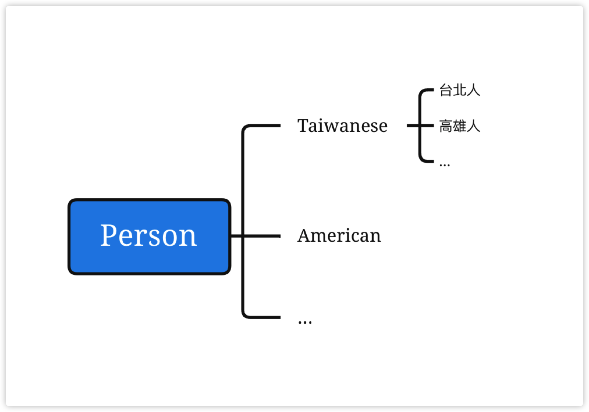

當類別間有一定程度關係時（相同或相似的成員），可以考慮是否使用物件導向三本柱中的「繼承」與「多型」，基底類別為被繼承的類別（父類別），而衍生類別則是繼承基底類別所產生的類別（子類別），也就是說，衍生類別具有基底類別一定的特性及能力。
## 基底類別與衍生類別的關係
以我們先前的Person來舉例：
Person類別有：Name屬性、Height屬性、Weight屬性、CalculateBMI方法以及ShowInformation方法。
```csharp
public class Person
{
    public string Name { get; set; }
    public double Height { get; set; }
    public double Weight { get; set; }

    private double CalculateBMI()
    {
        return Weight / Math.Pow(Height / 100, 2);
    }

    public void ShowInformation()
    {
        double bmi = CalculateBMI();
        Console.WriteLine($"{Name}的BMI為{bmi}");
    }
}
//Taiwanese類別繼承Person類別
public class Taiwanese : Person
{
    public void Speak()
    {
        Console.WriteLine($"{base.Name}說中文！");
    }
}

class Program
{
    static void Main(string[] args)
    {
        Taiwanese andy = new Taiwanese
        {
            Name = "Andy",
            Height = 175,
            Weight = 75
        }; 
        andy.ShowInformation();
        andy.Speak();
        Console.ReadLine();
    }
}
```

此時Taiwanese類別是Person的衍生類別，反之Person是Taiwanese的基底類別。

Taiwanese同時具有Person類別內的成員，也就是說Taiwanese的執行個體可以使用Name、Height、Weight屬性以及ShowInformation方法。
在Taiwanese類別內，透過`base`關鍵字呼叫基底類別，所以在Taiwanese內的Speak方法中`base.Name`就是基底類別的Name屬性。


> 一個類別只能繼承一個基底類別，衍生類別也可以當成另外一個類別的基底類別。

## 抽象類別和類別成員
在類別定義前加入`abstract`關鍵字，就可以將類別宣告為抽象類別，抽象類別沒有辦法具象化（也就是無法透過`new`產生執行個體），抽象類別的用途是提供基底類別的通用定義，透過繼承來建立衍生類別並在衍生類別內產生自己的類別實作。

```csharp
public abstract class Person
{
    public abstract void Speak();
}

public class Taiwanese : Person
{
    public override void Speak()
    {
        Console.WriteLine("中文");
    }
}

public class American : Person
{
    public override void Speak()
    {
        Console.WriteLine("English");
    }
}
```

抽象方法沒有任何實作，因此方法定義後面會接著一個分號，而不是一般方法區塊。
抽象類別的衍生類別必須實作所有抽象方法，並且需要加入`override`關鍵字。

## 密封類別和類別成員
在類別定義前面加入`sealed`關鍵字，就可以將類別宣告為密封類別。
```csharp
public sealed class MyClass
{
    
}
//這樣是錯誤的，因為MyClass是sealed，無法被當做基底類別繼承
public class SampleClass : MyClass
{

}
```
被宣告為密封類別的類別則不能當作基底類別使用，也就是不能被衍生（繼承）。
類別成員宣告為`sealed`時，則任何的衍生類別都不能在覆寫此成員。
```csharp
public class MyBaseClass
{
    public vitrual void Do()
    {
        
    }
}

public class MyClass : MyBaseClass
{
    public override void Do() { }
}

public class OtherClass : MyClass
{
    //因為基底類別的此方法已宣告sealed，故不能override
    //這個會報錯
    public override void Do()
    {

    } 
}
```

## 小結
- `abstract`關鍵字可以建立抽象類別和抽象成員，抽象成員必定是在抽象類別內。
- 抽象方法為不完整的成員（沒有實作），必須要在繼承其抽象類別的衍生類別內有實作。
- 宣告`virtual`關鍵字的成員可以讓衍生類別`override`其成員，產生新的實作，如果沒有`override`，則保留原來的實作。
- `sealed`關鍵字為密封，宣告為sealed的類別，則不能被當做基底類別（無法被繼承）；成員被宣告為sealed的話，則衍生的類別沒辦法`override`其成員（沒辦法另外產生新的實作）。


## 參考資料
- https://docs.microsoft.com/zh-tw/dotnet/csharp/programming-guide/classes-and-structs/abstract-and-sealed-classes-and-class-members
- https://docs.microsoft.com/zh-tw/dotnet/csharp/language-reference/keywords/virtual
